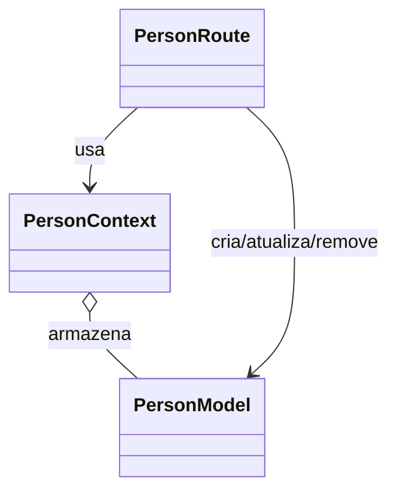

# Guia do Backend - Web API C#

Bem-vindo à documentação detalhada dos arquivos **PersonModel.cs** e **PersonRoute.cs** do projeto **Web API C#**. Aqui você encontrará descrições completas, diagramas e exemplos de uso para entender como estes componentes se relacionam e funcionam dentro da aplicação.

---

## Índice

1. [Visão Geral do Projeto](#visão-geral-do-projeto)
2. [Models/PersonModel.cs](#personmodelcs)  
   2.1. [Propósito](#propósito)  
   2.2. [Código e Estrutura](#código-e-estrutura)  
   2.3. [Detalhamento dos Membros](#detalhamento-dos-membros)
3. [Routes/PersonRoute.cs](#personroutecs)  
   3.1. [Propósito](#propósito-1)  
   3.2. [Configuração de Rotas](#configuração-de-rotas)  
   3.3. [Endpoints](#endpoints)  
   &nbsp;&nbsp;3.3.1. [Criar Pessoa (POST /person)](#criar-pessoa-post-person)  
   &nbsp;&nbsp;3.3.2. [Listar Pessoas (GET /person)](#listar-pessoas-get-person)  
   &nbsp;&nbsp;3.3.3. [Atualizar Pessoa (PUT /person/{id})](#atualizar-pessoa-put-personid)  
   &nbsp;&nbsp;3.3.4. [Remover Pessoa (DELETE /person/{id})](#remover-pessoa-delete-personid)
4. [Como estes arquivos se relacionam](#como-estes-arquivos-se-relacionam)

---

## <a name="visão-geral-do-projeto"></a>1. Visão Geral do Projeto

O **WebAPI_Person** é uma API REST leve para gestão de **pessoas**, armazenadas em um banco SQLite via Entity Framework Core.

- **Models** definem entidades de domínio.
- **Data** contém o `PersonContext` (DbContext).
- **Routes** expõem endpoints HTTP usando “minimal APIs” do ASP.NET Core.

---

## <a name="personmodelcs"></a>2. Models/PersonModel.cs

### <a name="propósito"></a>2.1. Propósito 📦

O `PersonModel` representa a entidade **Pessoa** no domínio da aplicação. Ele:

- Define propriedades persistidas no banco (`Id`, `Name`).
- Encapsula regras simples de negócio (alteração de nome).

### <a name="código-e-estrutura"></a>2.2. Código e Estrutura

```csharp
namespace WebAPI_Person.Models
{
    public class PersonModel
    {
        public PersonModel(string name)
        {
            Name = name;
            Id = Guid.NewGuid();
        }

        public Guid Id { get; init; }
        public string Name { get; private set; }

        public void ChangeName(string name)
        {
            Name = name;
        }
    }
}
```

### <a name="detalhamento-dos-membros"></a>2.3. Detalhamento dos Membros

| Membro                           | Tipo        | Acesso                       | Descrição                                             |
| -------------------------------- | ----------- | ---------------------------- | ----------------------------------------------------- |
| **PersonModel(string name)**     | Construtor  | Público                      | Cria nova instância. Gera `Id` único e define `Name`. |
| **Guid Id**                      | Propriedade | Público (init-only)          | Identificador único imutável.                         |
| **string Name**                  | Propriedade | Público (get), Privado (set) | Nome da pessoa, obrigatório.                          |
| **void ChangeName(string name)** | Método      | Público                      | Atualiza o nome da pessoa.                            |

> **Observação:** o encapsulamento de `Name` impede atribuições diretas após a criação, forçando uso de `ChangeName` para validar possíveis regras futuras.

---

## <a name="personroutecs"></a>3. Routes/PersonRoute.cs

### <a name="propósito-1"></a>3.1. Propósito 🚦

O `PersonRoute` configura **endpoints HTTP** agrupados em `/person`, usando minimal APIs do ASP.NET Core. Ele lida com operações CRUD (Create, Read, Update, Delete) de `PersonModel` via `PersonContext` (DbContext).

### <a name="configuração-de-rotas"></a>3.2. Configuração de Rotas

```csharp
namespace WebAPI_Person.Routes
{
    public static class PersonRoute
    {
        public static void PersonRoutes(this WebApplication app)
        {
            var route = app.MapGroup("person");
            // ... definição de endpoints ...
        }
    }
}
```

- **MapGroup("person")**: agrupa todas as rotas sob o prefixo `/person`.
- Cada endpoint injeta **PersonContext** para acesso ao DB e, quando necessário, **PersonRequest** para dados de input.

### <a name="endpoints"></a>3.3. Endpoints 📡

#### <a name="criar-pessoa-post-person"></a>3.3.1. Criar Pessoa (POST /person)

<summary>Cria uma nova pessoa no sistema.</summary>

```api
{
    "title": "Criar Pessoa",
    "description": "Adiciona uma nova pessoa ao banco de dados.",
    "method": "POST",
    "baseUrl": "http://localhost:{port}",
    "endpoint": "/person",
    "headers": [
        { "key": "Content-Type", "value": "application/json", "required": true }
    ],
    "pathParams": [],
    "queryParams": [],
    "bodyType": "json",
    "requestBody": "{\n  \"name\": \"Nome da Pessoa\"\n}",
    "responses": {
        "200": {
            "description": "Pessoa criada com sucesso",
            "body": "{\n  \"id\": \"guid\",\n  \"name\": \"Nome da Pessoa\"\n}"
        },
        "400": {
            "description": "Dados inválidos"
        }
    }
}
```

---

#### <a name="listar-pessoas-get-person"></a>3.3.2. Listar Pessoas (GET /person)

<summary>Retorna a lista completa de pessoas cadastradas.</summary>

```api
{
    "title": "Listar Pessoas",
    "description": "Obtém todas as pessoas cadastradas no banco.",
    "method": "GET",
    "baseUrl": "http://localhost:{port}",
    "endpoint": "/person",
    "headers": [],
    "pathParams": [],
    "queryParams": [],
    "bodyType": "none",
    "responses": {
        "200": {
            "description": "Lista de pessoas",
            "body": "[\n  { \"id\": \"guid\", \"name\": \"Pessoa A\" },\n  { \"id\": \"guid\", \"name\": \"Pessoa B\" }\n]"
        }
    }
}
```

---

#### <a name="atualizar-pessoa-put-personid"></a>3.3.3. Atualizar Pessoa (PUT /person/{id})

<summary>Atualiza o nome de uma pessoa existente.</summary>

```api
{
    "title": "Atualizar Pessoa",
    "description": "Modifica o nome de uma pessoa a partir do seu ID.",
    "method": "PUT",
    "baseUrl": "http://localhost:{port}",
    "endpoint": "/person/{id}",
    "headers": [
        { "key": "Content-Type", "value": "application/json", "required": true }
    ],
    "pathParams": [
        { "key": "id", "value": "GUID da pessoa", "required": true }
    ],
    "queryParams": [],
    "bodyType": "json",
    "requestBody": "{\n  \"name\": \"Novo Nome\"\n}",
    "responses": {
        "200": {
            "description": "Pessoa atualizada com sucesso",
            "body": "{\n  \"id\": \"guid\",\n  \"name\": \"Novo Nome\"\n}"
        },
        "404": {
            "description": "Pessoa não encontrada"
        }
    }
}
```

---

#### <a name="remover-pessoa-delete-personid"></a>3.3.4. Remover Pessoa (DELETE /person/{id})

<summary>Remove uma pessoa existente do sistema.</summary>

```api
{
    "title": "Remover Pessoa",
    "description": "Exclui uma pessoa pelo seu ID.",
    "method": "DELETE",
    "baseUrl": "http://localhost:{port}",
    "endpoint": "/person/{id}",
    "headers": [],
    "pathParams": [
        { "key": "id", "value": "GUID da pessoa", "required": true }
    ],
    "queryParams": [],
    "bodyType": "none",
    "responses": {
        "200": {
            "description": "Pessoa removida com sucesso",
            "body": "{\n  \"id\": \"guid\",\n  \"name\": \"Nome da Pessoa\"\n}"
        },
        "404": {
            "description": "Pessoa não encontrada"
        }
    }
}
```

---

## <a name="como-estes-arquivos-se-relacionam"></a>4. Como estes arquivos se relacionam 🔗

1. **PersonModel.cs** define a entidade e suas regras de domínio.
2. **PersonContext** (em `Data/PersonContext.cs`) expõe `DbSet<PersonModel>`.
3. **PersonRoute.cs** injeta `PersonContext` e utiliza `PersonModel` no fluxo de criação, leitura, atualização e deleção.



> Este diagrama de classes ilustra a relação entre roteamento, persistência e domínio.

---

✨ **Fim da Documentação** – Com esta referência você conseguirá entender e estender a API de pessoas com facilidade!
